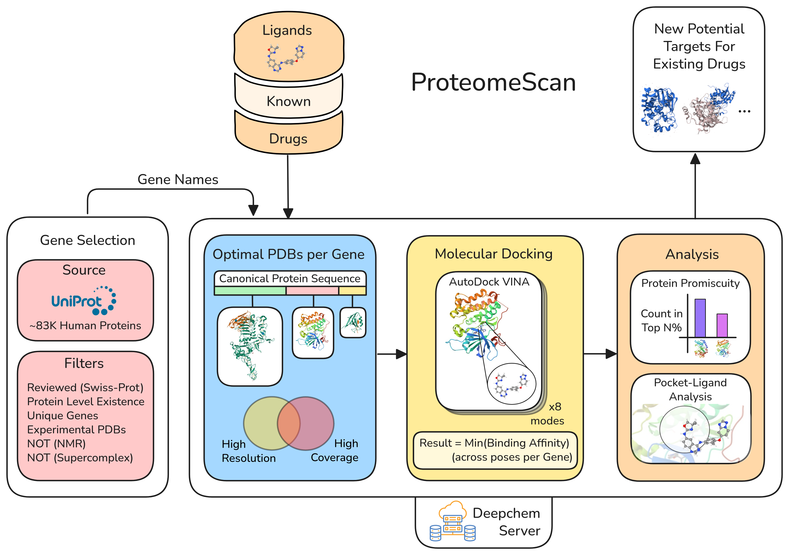

# ProteomeScan Pipeline

Complete end-to-end molecular docking pipeline for proteome-wide compound screening with automated promiscuity filtering and binding pose analysis.



## Overview

ProteomeScan is a modular, professional-grade pipeline that performs:
- **Automated PDB download** from RCSB database
- **High-throughput molecular docking** using AutoDock Vina
- **Intelligent promiscuity filtering** (25% threshold default)
- **Comprehensive binding pose analysis** using fpocket
- **Quality-based results filtering** (>50% pocket coverage)

## Requirements

### System Dependencies
- **Python 3.7+**
- **AutoDock Vina** (molecular docking)
- **fpocket** (binding site analysis)

### Python Dependencies
```bash
pip install pandas rdkit deepchem pathlib tqdm requests
```

**Core packages:**
- `pandas` - Data manipulation and analysis
- `rdkit` - Chemical informatics and molecular handling
- `deepchem` - Deep learning for chemistry (VinaPoseGenerator)
- `pathlib` - Modern file path handling
- `tqdm` - Progress bars for long-running operations
- `requests` - PDB file downloads

## Quick Start

### 1. Prepare Configuration File
Create a JSON configuration file (e.g., `config.json`):

```json
{
  "work_dir": "pipeline_results",
  "genes": [
    {"gene_name": "BRAF", "pdb_ids": ["4XV2", "5VAL"]},
    {"gene_name": "MEK1", "pdb_ids": ["3EQH"]},
    {"gene_name": "MAP2K1", "pdb_ids": ["4MNE"]}
  ],
  "ligands": [
    {"ligand_name": "Trametinib", "sdf_file": "Processed_Trametinib.sdf"},
    {"ligand_name": "Dabrafenib", "sdf_file": "Processed_Dabrafenib.sdf"}
  ]
}
```

### 2. Prepare Ligand Files
Place your processed ligand SDF files in a directory (e.g., `data/ligands/processed/`).

### 3. Run the Pipeline
```bash
python proteome_scan_pipeline.py \
  --config config.json \
  --sdf-dir data/ligands/processed/
```

## Pipeline Workflow

The pipeline executes the following steps automatically:

### Step 1: Gene Setup and PDB Download
- Creates gene directories in the working directory
- Downloads PDB structures from RCSB database using `setup_gene_from_config()`
- Validates file integrity and structure quality

### Step 2: Molecular Docking
- Performs blind docking using AutoDock Vina via DeepChem's `VinaPoseGenerator`
- Processes all gene-ligand pairs specified in configuration
- Saves top 2 docking results per gene-ligand combination
- Creates complex PDB files for successful docking runs

### Step 2.5: Promiscuity Filtering
- Loads promiscuity thresholds from `proteome_scan/promis_thresholds_may19.json`
- Filters out promiscuous targets using 25% threshold (25%_22 key)
- Saves computational resources by skipping pose analysis for promiscuous genes

### Step 3: Pose Analysis (Non-Promiscuous Only)
- Runs fpocket analysis on filtered, non-promiscuous complexes only
- Calculates pocket coverage and binding site statistics
- Generates detailed binding pose metrics

### Step 4: Results Processing and Filtering
- Compiles all pose analysis results
- Filters complexes with >50% pocket coverage
- Copies high-quality complexes to final results directory
- Generates comprehensive summary statistics

## Input Files

### Required Files
- **Configuration JSON**: Gene and ligand specifications
- **Ligand SDF files**: Processed small molecule structures
- **Promiscuity data**: `proteome_scan/promis_thresholds_may19.json` (included)

### Configuration Format
```json
{
  "work_dir": "output_directory_name",
  "genes": [
    {"gene_name": "GENE_SYMBOL", "pdb_ids": ["PDB1", "PDB2", "..."]}
  ],
  "ligands": [
    {"ligand_name": "COMPOUND_NAME", "sdf_file": "filename.sdf"}
  ]
}
```

## Output Structure

**Actual directory structure created by the pipeline:**

```
pipeline_results/                    # Main working directory
├── [gene_name]/                     # Per-gene directories
│   ├── [gene_name]_pdbs.csv        # PDB metadata
│   ├── complexes/                   # Generated protein-ligand complexes
│   │   └── complex_[gene]_[pdb]_[ligand].pdb
│   └── [pdb_files]                 # Downloaded PDB structures
├── [ligand_name]/                   # Per-ligand results
│   └── top_score_[gene]_[ligand].csv # Top docking scores
├── pose_analysis/                   # fpocket analysis outputs
│   └── [analysis_files]            # Binding site analysis results
├── results/                         # Final filtered results
│   └── high_coverage_complexes/     # >50% pocket coverage
│       ├── high_coverage_complexes.csv
│       └── complex_*_coverage_*.pdb # High-quality complexes
└── pipeline_results.csv            # Complete results summary
```

## Key Output Files

- **`pipeline_results.csv`**: Complete results with all metrics
- **`high_coverage_complexes.csv`**: Filtered results (>50% pocket coverage)
- **`complex_[gene]_[pdb]_[ligand]_coverage_X.Xpct.pdb`**: High-quality complex structures
- **`top_score_[gene]_[ligand].csv`**: Per-gene-ligand docking results

## Advanced Usage

### Custom Promiscuity Thresholds
The pipeline supports different promiscuity filtering levels. Available thresholds in the JSON file:
- `"10%_6"`: Strictest filtering (1051 non-promiscuous targets)
- `"25%_22"`: Default filtering (149 non-promiscuous targets)
- `"30%_22"`: More permissive filtering

### Example Commands

```bash
# Basic usage
python proteome_scan_pipeline.py \
  --config examples/kinase_screen.json \
  --sdf-dir data/ligands/processed/

# Large-scale screening
python proteome_scan_pipeline.py \
  --config configs/full_proteome.json \
  --sdf-dir /path/to/compound_library/

# Check results
ls pipeline_results/results/high_coverage_complexes/
cat pipeline_results/pipeline_results.csv
```

## Performance Notes

- **Computational Requirements**: Real molecular docking calculations (not simulation)
- **Processing Time**: ~5-15 minutes per gene-ligand pair depending on protein size
- **Promiscuity Filtering**: Saves ~75% of pose analysis computation time
- **Disk Space**: ~10-50 MB per gene depending on number of PDB structures
- **Memory**: Typically 1-4 GB RAM for moderate-scale screens

## Troubleshooting

### Common Issues

**1. Import Errors**
```bash
# If you see "ModuleNotFoundError: No module named 'proteome_scan'"
export PYTHONPATH="${PYTHONPATH}:$(pwd)"
python proteome_scan_pipeline.py --config config.json --sdf-dir data/ligands/processed/
```

**2. Missing Dependencies**
```bash
# Install missing packages
pip install deepchem rdkit pandas pathlib tqdm requests

# For conda users
conda install -c conda-forge rdkit pandas
conda install -c deepchem deepchem
```

**3. PDB Download Failures**
- Verify PDB IDs are valid in RCSB database
- Some PDB files may be temporarily unavailable

**4. AutoDock Vina Issues**
- Ensure AutoDock Vina is installed and in your PATH
- Check that protein and ligand files are properly formatted

## Development and Contributing

### Code Structure
```
proteome_scan/
├── __init__.py                      # Package initialization and imports
├── gene_pdb_utils/                  # PDB download and gene setup
│   ├── __init__.py
│   └── get_optimal_cleaned_PDBs.py
├── gene_guided_docking_utils/       # Docking and promiscuity filtering
│   ├── __init__.py
│   ├── gene_guided_docking.py       # Core docking functions
│   ├── promiscuity_filter.py        # Promiscuity filtering utilities
│   └── parse_results.py
└── pose_binding_analysis/           # Binding pose analysis
    ├── __init__.py
    └── analyse_pose_script.py
```

